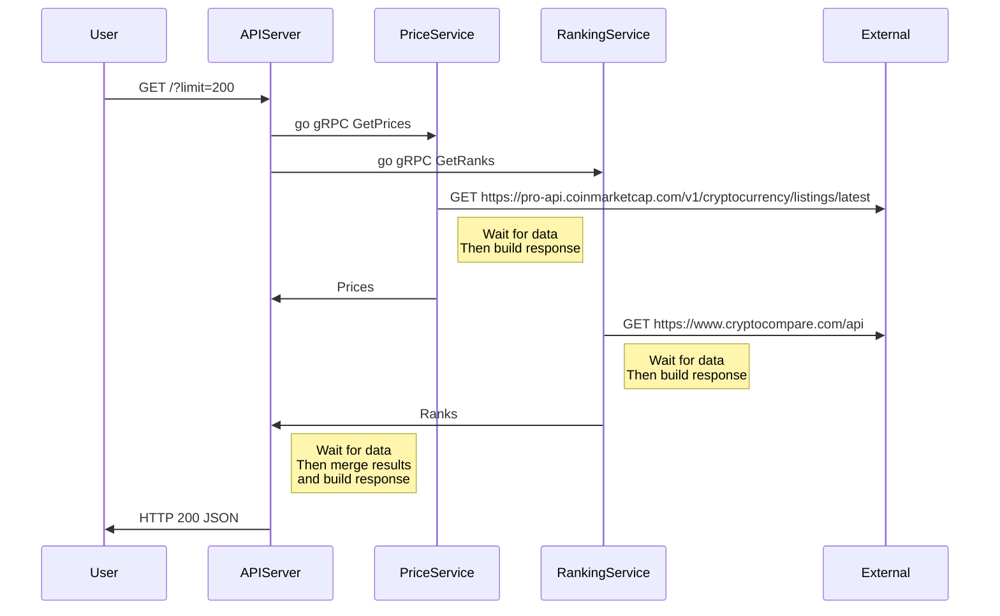
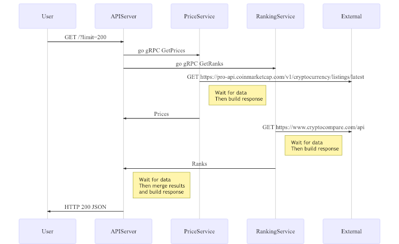
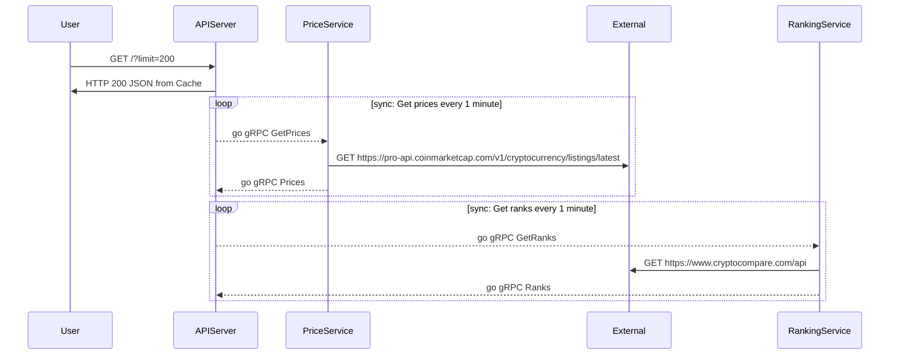
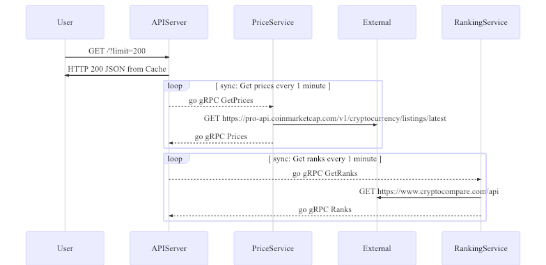
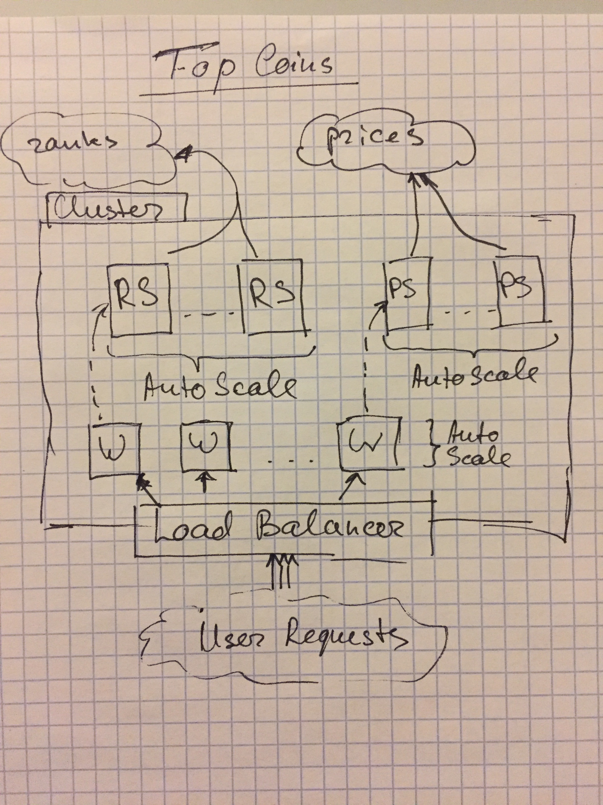

[](https://circleci.com/gh/miry/wattx_top_coins)
[](https://goreportcard.com/report/github.com/miry/wattx_top_coins)


# Top Coins Problem

# Development

## Create module

```shell
$ go mod init github.com/miry/wattx_top_coins
```

## Docker

Image: https://cloud.docker.com/repository/docker/miry/top_coins/general

## Run

Setup all dependicies:

```shell
$ ./bin/setup
```

Run application on local environment

```shell
$ go run cmd/top_coins/main.go
$ curl localhost:8080/version
```

Use containers to run application

```shell
$ ./bin/local
```

### Coinmarketcap

Commandline Client to the service https://coinmarketcap.com/api/documentation/v1/

```shell
$ go run cmd/coinmarketcapctl/main.go --api-key=xxxx
```

## Requirements

- It should have scalable components
- Deploy each component independently
- Have Service Discovery
- Monitoring
- Logging
- Tests
- Tracing
- [Go modules](https://github.com/golang/go/wiki/Modules)

## Design

### Naive approach

Collect data on demand.




This approach is good for debug and as skeleton for application. Have big problems:
- high latency
- rely on external services, if something wrong could not build correct results
- duplicate requests

### Cache layers

Pre build API response.





This approach would allow us to serve requests, even when the services are down. It would add Availability, instead of consistency.
Same approach we can do with services. Base on rerquirerments, memory usage would not be high. If it would be required to process a big amount of data, than it could be extracted to differnt storage, base on load and  scalibility. Example distributed cache for go applications or use FoundationDB (or similar DataStorages depends on load and availability).

### Update cache on changes

Another approach to update local cache by notification on changes. Everytime a service get updates of new data. It cacluclattes Hash of it and sends to subscribers on new changes. Subscribers can verify that hash is changed, and requests new records back.

# Walking Skeleton

Before work on main feature. I first build a walking skeleton. Where built sample services, with fake data and responses. It helps developers to build CI/CD with concurent developing features.

1. Build API server with static response
1. Build Kubernetes cluster with all resources required to serve multi branch deployment of the web application
1. Automate run tests
1. Build pipeline for delivery a new changes to staging. Check tasks: Tests, Lint(Languages and Pronto), Deploy, Run e2e tests (optional)

## Folder structure

The project tries to follow the almost standard [go project layout](https://medium.com/golang-learn/go-project-layout-e5213cdcfaa2).

## Kubernetes

Kubernetes is more than just a container orchestrator at this point. What it really does is provide a complete platform for running a distributed application in the cloud.
Because people on hype about it, so most of hosting providers built kubernetes services and manage it for developers.

Features that are usefull:

- Ingress controller: Allow to manage subdomains base on code and integration wit cloud provider LB.
- Prometheus operator: Get metrics from services (apps, ingress controllers, cloud autoscaler and etc).
- Service: Gives ability to load balance requests betweend containers(IPVS gives more performance) and service discovery.
- Autoscale containers base on metrics
- Allow to run staging/production env on local machine with minikube or docker kubernetes for mac
- There are many pipelines tools for kubernetes
- Authorisation with Google, Azure or other OpenID providers

## Monitoring

Depends on programming language. Some common tools: Newrelic, Prometheus, Influxdb. For tracing: Zippkin, Jaeger. Most of such services have integration with PagerDuty to send notifications via SMS, Phone call or chat channels. Grafana as free tool to build dashboards.

## Message Queue

I prefer working with Nats, because it is simple to setup and debug. There is Liftbridge project, that makes nats streaming reliable as Kafka. Kafka is a complex system. Requires understands and maintain of Zookeeper. Then tune kafka brokers. For this project it could be used for tracking requests.

## Datastore

Becuase use of container solution there are multiple projects, that could be deployed safe to it: CockroachDB, TiKV(TiDB), Couchbase, Postgres (with stolon), Vitess.

## Logging

Kubernetes provide logs per pod. It is possible to deploy Elasticsearch cluster with Fluentd and Kibana. For small projects it makes sense to use services.

## CI/CD pipeline

All scripts to build and deliver applications should be inside repo. CircleCI provides ability to have config in the repo to automate. In cluster solutions: Teamcity,DroneIO, Argo and similar. To elliminate tolls - evertyhing should be automated.

## RPC

For microservices it always need to have ability run different services written in different laguages. For this reason I choose gRPC. It uses protobuf, in my opnion it is complex and would prefer msgpack. In same time protobuf provide a lot of specification about messages. gRPC support SSL communication that gives us ability to build zero trust architecture. Complexity - manage SSL certificates.

## Discovery

By default it is enough to have Kubernetes discovery solution. Also it could be used Consul.


# API server

It should be stateless applicaiton. Depends on SLA: Latency, Threoughput, Budget and Developers skills could be implemented on different language. This information is missing. Go would be a good choice because of same hype. Alternatives: Erlang(Elixir), Ruby, Rust, Crystal(missing grpc), Python.
Depends on traffic, Serveless approach could be used.

# Services streaming

You can pick any language, that makes less memory consumption and has grpc protocol implementation: Go, Ruby, Python.

# Short live tasks

Kubernetes gives solution to run con tasks. For solution where need only scrape data from external services and put to DB. Then API server can read from DB directly without grpc. Any language.



